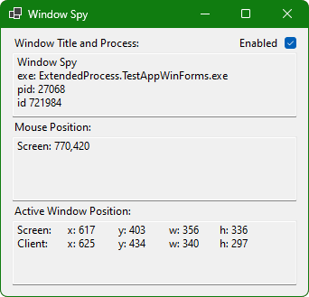

# ExtendedProcess .NET
_ExtendedProcess_ is a .NET 6.0 library written in C# for interacting with process windows on Windows. The solution contains 2 projects:
* `ExtendedProcess.Library`: The primary library that can be referenced to interact with process windows.
* `ExtendedProcess.TestAppWinForms`: A Windows application that mimics the design of [AutoHotkey's Window Spy](https://amourspirit.github.io/AutoHotkey-Snippit/WindowSpy.html).  


# Building
## Requirements
* .NET 6.0

## Build
### Manual
* `dotnet`:
  ```
  $ git clone <origin> \
    && cd <dir> \
    && dotnet build
  ```
* `make`:
  ```
  $ git clone <origin> \
    && cd <dir> \
    && make -C src build
  ```

### CI/CD
* Builds on GitLab are automated via [.gitlab-ci.yml](.gitlab-ci.yml). NuGet packages are published to the repository registry when pushed to the default branch, and releases are created when pushed to the main branch with a SemVer tag.
* Builds on GitHub are automated via [build.yaml](.github/workflows/build.yaml). Artifacts are built, but not published or released.

# License
* [ExtendedProcess](LICENSE.md)
